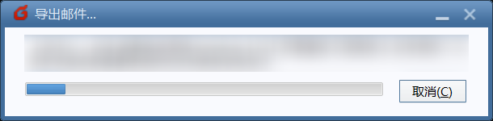

# Mail Stat 快速入门

**注意：请不要在QQ内直接访问本教程。请使用外部浏览器或者电脑。**

以查看学校邮箱中的非学校邮件为例。

如果你更喜欢自己探索而不是循规蹈矩，下面是一个对教程的简要说明：

1. 用 Foxmail 收取邮件并导出 eml 文件
2. 配置 Python 3 环境，运行 `mailstat.py` 脚本
3. 用 Excel 处理 (2) 中导出的 `out.txt`，使用数据透视表得到邮件来源统计

如果你已经多次尝试本教程但遇到问题，请向身边认识的 CS/EE 同学寻求帮助，并向他们展示本教程，他们应该能够解决你的问题。

| :large_orange_diamond: 声明                                  |
| ------------------------------------------------------------ |
| 仅在我自己的电脑上进行过测试。如果有问题请随时反馈。 我的环境：Windows 10 x86 v1809, Python 3.7.1 (Anaconda) |

## Step 1: 安装 Foxmail 并导出 `eml` 文件

1. 去 [Foxmail 官网](https://www.foxmail.com)下载并安装 Foxmail

2. 用学校邮箱登录，点击完成，进入主界面

   

   

3. 在“收取更多”窗口点击右上角的X 关闭这一窗口

   

4. 在邮箱账户上右键，按下图操作，选择“只收取邮件头”（这样做能大大加快速度）
   [收取：把邮件从云端下载到本地]

   

5. 在邮箱账户上邮件，选择“收取”，等待一小会（视邮件数量可能多达 20 分钟，请保持耐心）
   （你可能发现此步骤中收取的邮件数量小于第3步中的总邮件数量，这是正常现象，因为有一部分未读邮件已经被收取到本地了）

   

6. 邮件收取完成后，点击收件箱，点击右侧任意一封邮件，按下快捷键`Ctrl+A`全选邮件，右键选择`导出邮件`，选择一个合适的导出目录（下图中我放在了桌面的`mailexp`文件夹），耐心等待导出完成。

   

   

   

Step 1 到此结束。

## Step 2: 准备 `mailstat.py` 脚本和相关环境

| :heavy_exclamation_mark: 注意：前提要求                      |
| ------------------------------------------------------------ |
| 在进行前请保证电脑上已经安装了 Python 3 环境 检测方式：打开命令提示符，输入 `python`， 观察输出中的版本号 如下图所示，版本号为3.6或3.7即可继续进行  如果没有安装 Python 3，请参考[此教程](https://blog.csdn.net/weixin_40844416/article/details/80889165)，或者**寻找你熟悉的一位 CS/EE 的同学帮忙**。 |

1. 打开[此链接](https://raw.githubusercontent.com/jerrylususu/mailstat/master/mailstat.py)，按下快捷键`Ctrl+A`选中全部内容，粘贴到记事本中，保存为`mailstat.py`文件
   注意保存的时候，保存类型选择“所有文件”

   

2. 修改`mailstat.py`，找到`path = ...`这行，修改后边的路径为此前`eml`文件的导出路径（注意使用反斜线作为路径分隔符！）

   

3. 打开命令提示符（或者`Anaconda Prompt`），运行`pip install eml-parser`，最后应该能看到成功安装
   

Step 2 到此结束。

## Step 3: 运行 `mailstat.py`

1. 打开命令提示符（或者`Anaconda Prompt`），先输入`python`，再输入一个空格

   

2. 在资源管理器中找到 Step 2 中保存的 `mailstat.py`，把它拖入命令提示符（或者`Anaconda Prompt`），然后应该会自动填充地址

   

   

3. 按下回车，让程序开始运行。运行过程中屏幕上会显示正在处理的邮件和标题，如下图所示。等待程序执行完成。

   

4. 然后应该就能在第(1)小步中的目录下找到`out.txt`文件。（如上图中为`C:\Users\jerry`文件夹）

Step 3 到此结束。

## Step 4: 在 Excel 中进行后续处理

1. 程序执行完成后，打开  `out.txt` 文件，全选并复制。打开 Excel，新建文件，选择 A1 单元格，然后按下 `Ctrl+V` 粘贴。

   

2. 选中 A 列，点击上方“数据——分列”

   

3. 在“文本分割向导”中先选择“分隔符号”，点击下一步

   

4. 在“其他”中填入美元符号`$`，下方的数据应该已经分出了时间、发件地址、邮件标题三列。点击完成。

   

5. 回到表格，先在 B 列后添加一列

   

6. 选中 B 列，然后重复(3)(4)两步，但是把分隔符号用`@`代替

   

7. 回到表格，在第一行前添加一行，输入下图内容

   

8. 选中 A-D 四列，点击上方“插入——数据透视表”，在弹出窗口中点击确定

   

   

9. 在右侧选择`domain`，分别拖到下方 “行” 和 “值” 区域内。完成后左侧应该已经出现了发送域名及其计数。

   

10. 左侧点击“行标签”旁边的小三角，选择“其他排序选项”

    

11. 选择“降序排序”，“计数项: domain”，点击确定

    

12. Volia! 完成了。

    

